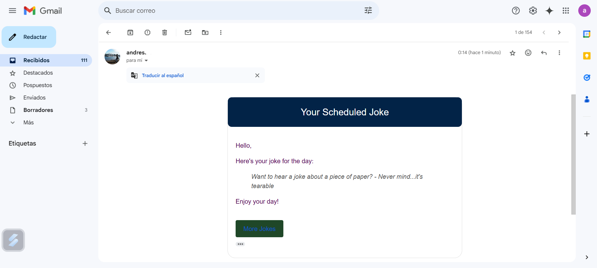

# JokeMailer

JokeMailer is an automated email service designed to send jokes periodically using a sleek HTML email template. The project fetches random jokes from an external API and dynamically embeds them into a custom-designed email template before dispatching them.



---

## Getting Started

### Prerequisites
To run JokeMailer locally, you need:
- **Python 3.8+**
- **pip (Python package manager)**
- A **Gmail account** for sending emails (other SMTP servers are supported with configurations)
- **Internet connection** for fetching jokes from the external API

### Installation

1. Clone the repository:
   ```bash
   git clone 'https://github.com/Rov95/JokeMailer.git'
   cd jokemailer
   ```

2. Install the required dependencies:
   ```bash
   pip install -r requirements.txt
   ```

3. Create a `.env` file in the project directory with the following environment variables:
   ```env
   EMAIL_ADDRESS=<your-gmail-address>
   EMAIL_PASSWORD=<your-app-password>
   RECIPIENT_EMAIL=<recipient-email-address>
   ```

   **Note:** Ensure you create an [App Password](https://support.google.com/mail/answer/185833?hl=en) for your Gmail account.

### Running the Application

1. Execute the main script to start the email automation:
   ```bash
   python sendEmail.py
   ```

2. The script will send a joke email every 120 seconds until interrupted. Press `Ctrl + C` to stop the automation.

---

## Tech Stack

### Backend
- **Language:** Python 3
- **Framework:** SMTP with smtplib for email communication
- **Joke API:** [Official Joke API](https://official-joke-api.appspot.com) for joke retrieval
- **Environment Management:** dotenv for securely handling environment variables

### Frontend (Email Template)
- **HTML:** Custom HTML email design using inline styles for compatibility

---

## Features

- Automated email dispatch every 120 seconds
- Integration with the Official Joke API for dynamic joke fetching
- Custom HTML email template for a modern, visually appealing email design
- Exception handling for email and API errors

---

## Contributors

JokeMailer was developed by:
- **[Andres Menco](https://github.com/Rov95)** - Development and project design

Contributions, bug reports, and feature requests are welcome! Feel free to open an issue or submit a pull request on [GitHub](https://github.com/Rov95/JokeMailer.git).

